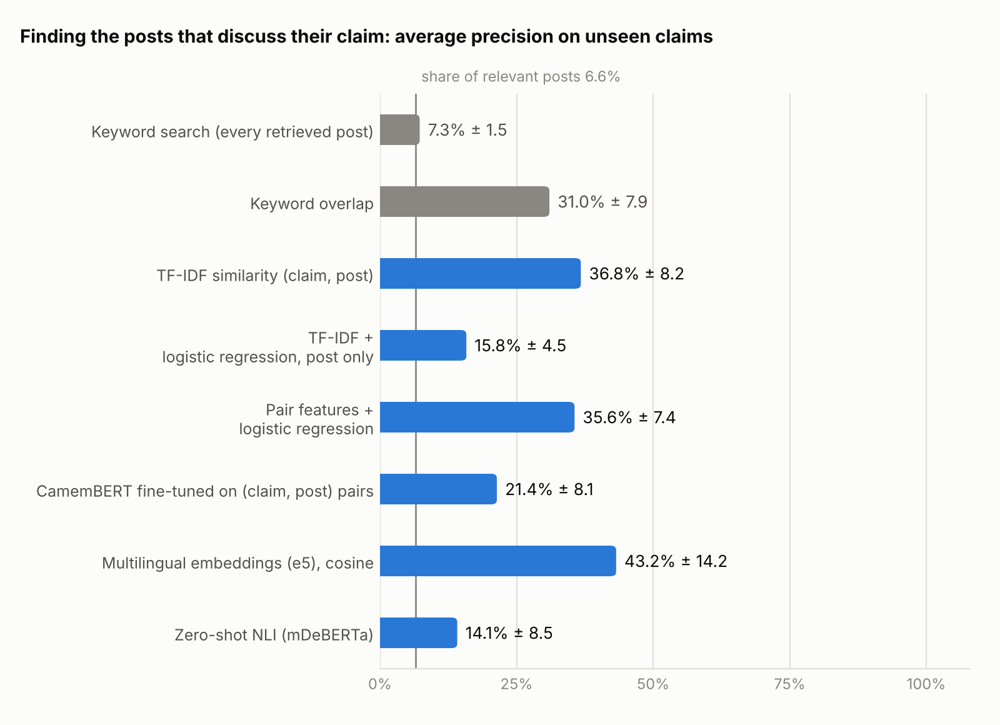

# French Disinformation Classifier

Which French Reddit posts discuss a claim that fact-checkers have checked, and what do they say about it?

The project started as a classifier that labelled posts true, misleading or unverifiable. Its accuracy fell to chance on claims it had not seen in training. Labelling every post showed why: 93% of the posts never discuss the claim they were collected for. The project now does two things. It ranks posts by how likely they are to discuss a given claim, and it measures what the relevant posts say about that claim.

| Step | Result |
|---|---|
| Version 1: predict the claim's verdict from the post | 65.6% accuracy when test claims also appear in training, 37.6% on unseen claims (chance: 33.3%) |
| Label all 3,341 posts | 219 posts (6.6%) discuss their claim. Of the 771 posts collected for misleading claims, 8 relay the claim. |
| Rank posts by relevance to their claim, on unseen claims | Multilingual sentence embeddings, with no training: average precision 43.2%, against 7.3% for the keyword search alone. Reading the top 20% of posts finds 80% of the relevant ones. A fine-tuned CamemBERT reaches 21.4%. |
| Predict the stance of relevant posts | Zero-shot NLI and cue-word rules reach a macro-F1 of 47.8% and 47.0%. Only 25 posts refute their claim; NLI finds 12 of them. |

<picture>
  <source media="(prefers-color-scheme: dark)" srcset="reports/relevance/ap_dark.png">
  
</picture>

## Data

- **Claims**: 48 claims checked by Les Décodeurs (Le Monde) and AFP Factuel, 16 per verdict (true, misleading, unverifiable). `data/claims.csv` gives each claim with its theme and search keywords.
- **Posts**: 3,341 Reddit posts, mostly from r/france (2,358) and r/francophonie (982), returned by Reddit's keyword search on each claim's keywords. They were collected in 2026 and cover 46 claims. The post text is not redistributed: `data/post_ids.csv` lists the post IDs with the claim that retrieved each one.
- **Stance labels**: in `data/stance_labels.csv`, every post is labelled off-topic, supports, refutes or discusses relative to the claim that retrieved it, following `docs/annotation_guide.md`. The labels were produced with Claude (an LLM), which read each post's opening and, when that was not enough, its first 250 words. To check them, I labelled 50 posts without seeing the LLM labels (`data/verification_sample.csv`). The two sets of labels agree on 47 of 50 posts (94%, Cohen's kappa 0.91). The 3 disagreements are news headlines that imply the claim without stating it.

## Version 1: predicting the verdict

Each post took the verdict of the claim whose keywords retrieved it. A TF-IDF and logistic-regression classifier was then trained to predict that verdict from the post text (`src/v1_preprocess.py`, `src/v1_evaluate.py`, three balanced labels of 769 posts).

| Model (5-fold CV, 5 seeds) | Random split | Unseen claims |
|---|---|---|
| Text model (TF-IDF + logistic regression) | 65.6% ± 1.9 | 37.6% ± 5.9 |
| Claim lookup: label of the post's claim | 99.9% ± 0.1 | 31.9% ± 0.9 |
| Theme only: most frequent label of the post's theme | 60.2% ± 1.6 | 36.1% ± 16.9 |

- With a random split, every test claim also appears in training, so knowing the claim gives the label almost perfectly.
- Themes and verdicts are confounded. The 6 technology claims are all unverifiable, and none of the 5 economy claims is misleading. The theme alone reaches 60.2%.
- The model's strongest terms are the subjects of the claims: "retraites" for misleading, "jo" and "paris 2024" for true, "ia" and "télétravail" for unverifiable.
- When whole claims are held out (`StratifiedGroupKFold` grouped by claim), the text model falls to 37.6%, the level of the theme-only baseline.

The model recognised the claims of its training set and could not judge the posts. Full results are in `reports/v1/results.md`.

## What the posts say about their claim

A label from the claim says nothing about what an individual post says. To measure that, every post was labelled by its stance towards the claim that retrieved it:

| Verdict of the claim | Off-topic | Supports | Refutes | Discusses | Posts |
|---|---|---|---|---|---|
| Misleading | 723 | 8 | 15 | 25 | 771 |
| True | 1,535 | 79 | 0 | 21 | 1,635 |
| Unverifiable | 864 | 28 | 10 | 33 | 935 |
| **All** | **3,122** | **115** | **25** | **79** | **3,341** |

- Keyword search returns posts that share the claim's words. A search for the 2024 immigration law, partly struck down by the Constitutional Council, returns posts about other laws the Council struck down. A search for "2023 is the hottest year on record" returns daily and monthly temperature records.
- Version 1's "misleading" class came from these 771 posts: 94% of them do not discuss their claim, and 1% relay it. Its labels described how the posts were found.
- Six claims have no relevant post at all, and one claim (Marine Le Pen's conviction) accounts for 40 of the 219 relevant posts.

## Finding the posts that discuss a claim

**Task.** Each model scores a (claim, post) pair, and posts are ranked by score. The positive class is "the post discusses its claim" (supports, refutes or discusses): 219 of 3,341 pairs. `src/relevance.py`.

**Evaluation.** There are 5 folds grouped by claim, so a test claim never appears in training, repeated with 3 seeds (`data/folds.csv`). Two metrics:
- **Average precision (AP)**: the area under the precision-recall curve. A random ranking scores the share of relevant posts (6.6%).
- **Reading load**: the share of a fold's posts to read, best-ranked first, to find 80% of its relevant posts.

| Model | Training | Average precision | Reading load for 80% recall |
|---|---|---|---|
| Keyword search: every retrieved post, in random order | none | 7.3% ± 1.5 | 80.3% ± 6.5 |
| Keyword overlap: share of the claim's keywords in the post | none | 31.0% ± 7.9 | 40.1% ± 5.8 |
| TF-IDF similarity between the claim and the post | none | 36.8% ± 8.2 | 27.2% ± 10.3 |
| TF-IDF + logistic regression on the post alone | supervised | 15.8% ± 4.5 | 39.6% ± 8.0 |
| Pair features + logistic regression | supervised | 35.6% ± 7.4 | 26.0% ± 8.1 |
| Multilingual sentence embeddings (e5): cosine between the claim and the post | none (pre-trained) | **43.2% ± 14.2** | **20.4% ± 6.6** |
| Zero-shot NLI (mDeBERTa): probability that the post entails "this text is about the claim" | none (pre-trained) | 14.1% ± 8.5 | 73.8% ± 20.1 |
| CamemBERT fine-tuned on (claim, post) pairs | supervised | 21.4% ± 8.1 | 36.4% ± 5.1 |

- **Pre-trained similarity does best.** The e5 encoder was trained on millions of (query, passage) pairs to give texts with the same meaning close vectors. It ranks relevant posts best, with a large spread across folds (± 14.2). Inside a claim, it puts the relevant posts first with an average precision of 71%, against 59% for TF-IDF (mean over the 23 claims with at least 3 relevant posts).
- **TF-IDF similarity is a strong baseline.** The unsupervised cosine between the claim and the post, computed on the post's first 60 words and on the whole post, reaches an average precision more than five times the share of relevant posts.
- **Learning adds little on unseen claims.** The pair model combines seven features (cosine and keyword overlap on the opening and on the whole post, claim words in the opening, length, title-only post). It matches plain similarity. Its largest weight goes to the similarity of the opening (+1.40, standardised). With 219 positives spread over 40 claims, there is little to learn beyond similarity that carries over to new claims.
- **Fine-tuning CamemBERT does worse than similarity.** Each fold trains it on about 175 relevant pairs from about 32 claims. Its scores follow the post-only model (Spearman correlation 0.69) more than e5 (0.49), and 41% of their variance lies between claims, against 21% for e5. Inside a claim, its average precision is 45%, the level of the post-only model (43%). It learned which kinds of posts were relevant for the training claims, more than whether a post matches its own claim.
- **A model that reads only the post learns topics.** TF-IDF + logistic regression on the post alone reaches 15.8%. Without the claim, it can only learn which subjects tend to be relevant in the training claims.
- **Zero-shot NLI is the wrong tool for relevance.** NLI models are trained to judge whether a premise implies a statement about the world. "This text is about the claim" is a statement about the text itself, and the entailment probability barely separates relevant posts.

**Errors** of the pair model on seed 0 (`reports/relevance/errors_seed0.csv`):
- The highest-scored off-topic posts share the claim's words but not its object. They are about another law struck down by the Constitutional Council, public debt passing 2,000 billion euros for a claim about 3,000 billion, the 2015 fall in life expectancy for a claim about Covid, or emission statistics for a claim about missed targets.
- The lowest-scored relevant posts make their point in other words. Examples are a satirical investigation of the companies behind 5G health-scare ads, and long posts that reach the claim after their opening paragraph.

The embeddings fix part of the second kind of error: e5 moves these 15 relevant posts from the bottom of the pair model's ranking to the 81st percentile of their fold on average. The first kind remains: e5 places the 15 off-topic posts at the 85th percentile on average. None of the models compares laws, figures or dates.

## What relevant posts say

Stance prediction on the 219 relevant posts (`src/stance.py`). The trained model uses 5 folds grouped by claim and 3 seeds.

| Model | Macro-F1 | Accuracy | Recall: supports / refutes / discusses |
|---|---|---|---|
| Majority label (supports) | 23.0% | 52.5% | 100% / 0% / 0% |
| Cue words: debunk vocabulary → refutes, a question in the opening → discusses, otherwise supports | 47.0% | 60.3% | 87% / 20% / 34% |
| TF-IDF + logistic regression | 39.4% ± 1.0 | 52.4% | 55% / 4% / 64% |
| Zero-shot NLI (mDeBERTa, no training): entailment → supports, contradiction → refutes, neutral → discusses | 47.8% | 50.2% | 37% / 48% / 71% |

- With 25 refuting posts, no trained model learns to recognise a refutation: the logistic regression finds 1 of the 25.
- The cue-word rules find 5, because they encode the vocabulary of debunking ("faux", "intox", "complot") directly.
- The NLI model, which needs no examples, finds 12. It also labels 64 of the 115 supporting posts as discussing: NLI asks whether the post implies the claim's exact statement, while the guide counts any post that presents the event as fact as support.
- Detecting posts that relay misinformation would need many more relevant posts, collected with a better search than keywords.

## Running the transformer models (Google Colab)

`notebooks/transformers_colab.ipynb` runs the three transformer models on the same folds, on a T4 GPU in 20 to 30 minutes:
1. multilingual sentence embeddings (`intfloat/multilingual-e5-base`), scoring each pair by cosine similarity, without training;
2. zero-shot natural language inference (`MoritzLaurer/mDeBERTa-v3-base-xnli-multilingual-nli-2mil7`). For relevance it tests whether the post entails "this text is about the claim"; for stance it tests whether the post entails or contradicts the claim;
3. CamemBERT (`almanach/camembert-base`) fine-tuned on (claim, post) pairs for relevance.

The notebook writes `reports/transformers/relevance_scores.csv` and `stance_nli.csv`, which hold post IDs and scores and no text. `src/relevance.py` and `src/stance.py` read them and score these models with the same code as the others. CamemBERT's settings (3 epochs, 256 tokens, learning rate 2e-5) were fixed in advance and not tuned.

## Limits

- **LLM labels, checked on 50 posts.** The check sample over-represents relevant posts (30 of 50) and off-topic posts that resemble their claim (10 of 20), so 94% agreement is measured on the hard part of the data. It is a single check on 1.5% of the posts. The line between off-topic and discusses remains a judgement call, and the guide settles it strictly: a post about a related but different event (another law, another year, another figure) is off-topic.
- **Few positives.** 219 relevant posts and 25 refutations make every metric noisy, as the standard deviations across folds show.
- **Recall of the collection is unknown.** Posts that discuss a claim without using its keywords were never collected, so no model here can find them.

## Run it

All scripts need the collected posts in `data/posts_raw.csv`, with the columns `post_id`, `claim_id`, `subreddit`, `created_utc` and `text` (title and body).

```bash
pip install -r requirements.txt
cd src
python v1_preprocess.py && python v1_evaluate.py   # version 1 -> reports/v1/
python relevance.py                                # relevance ranking -> reports/relevance/, data/folds.csv
python stance.py                                   # stance x verdict, stance models -> reports/stance/
```

## Repository

- `docs/annotation_guide.md`: definitions and rules for the four stance labels
- `data/`: claims, post IDs, stance labels, the 50-post label check and cross-validation folds
- `src/common.py`: loading, cleaning and folds grouped by claim
- `src/relevance.py`, `src/stance.py`: models, evaluation and reports
- `src/v1_preprocess.py`, `src/v1_evaluate.py`: version 1, predicting the verdict
- `notebooks/transformers_colab.ipynb`: transformer models on Colab
- `reports/`: results in Markdown and JSON, figures, error lists
