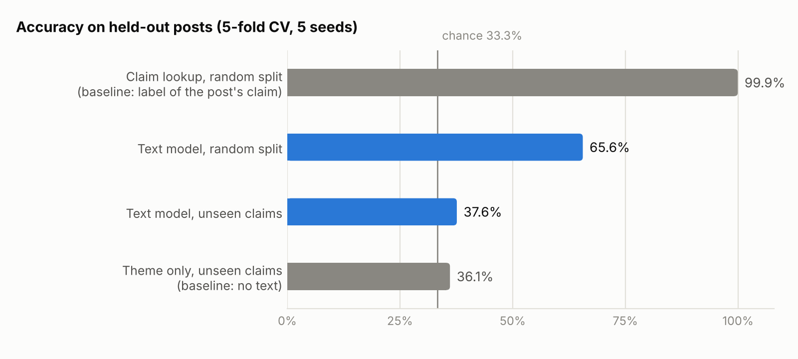

# French Disinformation Classifier

Can a text classifier tell true, misleading and unverifiable claims apart in French Reddit posts? This project builds a dataset from published fact-checks, trains a TF-IDF and logistic-regression classifier, and tests whether its accuracy holds on claims it has never seen.

| Evaluation (5-fold cross-validation, 5 seeds) | Accuracy |
|---|---|
| Posts assigned to folds at random | 65.6% ± 1.9 |
| Whole claims held out of training | 37.6% ± 5.9 |
| Chance, three balanced labels | 33.3% |

On new claims the model barely beats chance: it has learned to recognise the claims of its training set.

<picture>
  <source media="(prefers-color-scheme: dark)" srcset="reports/accuracy_dark.png">
  
</picture>

## Data

- **Claims**: 48 claims checked by Les Décodeurs (Le Monde) and AFP Factuel, with their verdict (true, misleading or unverifiable), theme and search keywords, in `data/claims.csv`.
- **Posts**: Reddit posts from r/france and r/francophonie returned by a search on each claim's keywords. Every post takes the verdict of the claim that retrieved it.
- **Cleaning**: duplicates and posts under five words removed, then the larger labels undersampled. 3,341 posts collected, 2,307 kept (769 per label), covering 46 claims.

The post text stays on Reddit: `data/post_ids.csv` lists the post IDs. The posts were collected in 2026 from Reddit's search results. `src/collect.py` redoes the collection through the official Reddit API, which has granted new credentials only on request since November 2025; the script has been tested offline only.

## Why the labels mislead the model

A post found with the keywords of a misleading claim may repeat the claim, mock it or debunk it; it is labelled "misleading" in every case. The label records which claim retrieved the post. Two baselines that never read the text show how much this explains:

| Model | Random split | Unseen claims |
|---|---|---|
| Text model (TF-IDF + logistic regression) | 65.6% ± 1.9 | 37.6% ± 5.9 |
| Claim lookup: label of the post's claim | 99.9% ± 0.1 | 31.9% ± 0.9 |
| Theme only: most frequent label of the post's theme | 60.2% ± 1.6 | 36.1% ± 16.9 |

- With a random split, every test claim also appears in training, so knowing the claim gives the label almost perfectly.
- Themes and verdicts are confounded: in the dataset, the 6 technology claims are all unverifiable and none of the 5 economy claims is misleading. The theme alone already reaches 60.2%.
- The model's strongest terms are the subjects of the claims: "retraites" for misleading, "jo" and "paris 2024" for true, "ia" and "télétravail" for unverifiable.

When whole claims are held out (`StratifiedGroupKFold` grouped by claim), the text model falls to 37.6%, in line with the theme-only baseline.

## Next steps

- Label a sample of posts on what they say about their claim (supports, refutes, discusses), then train on those labels.
- Keep evaluating on held-out claims, the only setting that matches use on new rumours.

## Run it

```bash
pip install -r requirements.txt
# Reddit API credentials, granted on request since November 2025
export REDDIT_CLIENT_ID=... REDDIT_CLIENT_SECRET=... REDDIT_USER_AGENT="disinfo-study by u/<your username>"
python src/collect.py --ids   # re-download the posts (or --search to query Reddit again)
python src/preprocess.py      # clean, deduplicate, balance -> data/posts_clean.csv
python src/evaluate.py        # cross-validation, baselines, figures -> reports/
```

Posts deleted since the collection are no longer available, so a new run can differ slightly from the figures above.

## Repository

- `src/collect.py`: collection through the official Reddit API (PRAW), tested offline only
- `src/preprocess.py`: cleaning and label balancing
- `src/evaluate.py`: both evaluation protocols, baselines and figures
- `reports/results.md`: full results, confusion matrices and top terms per label
